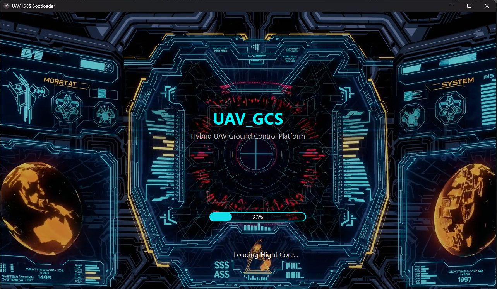
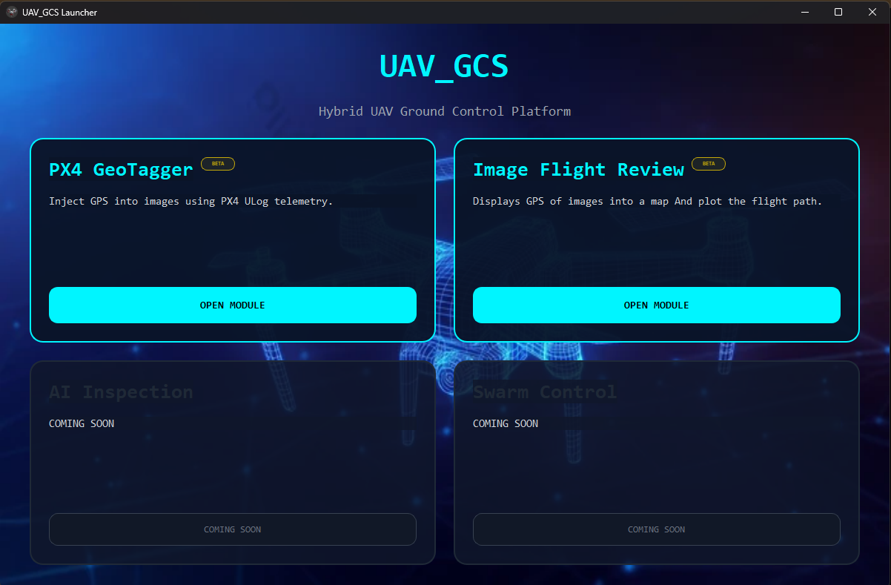
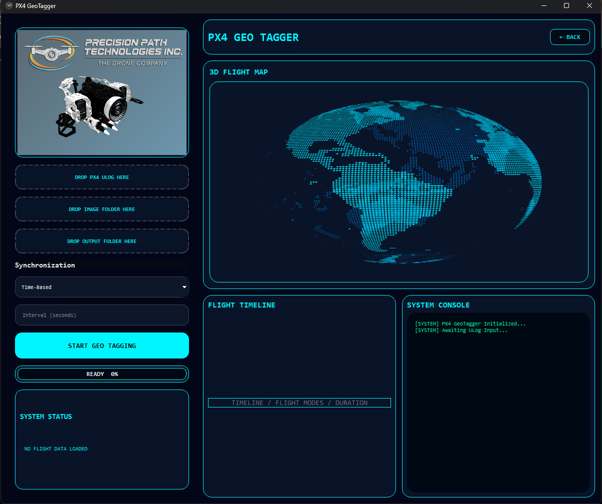
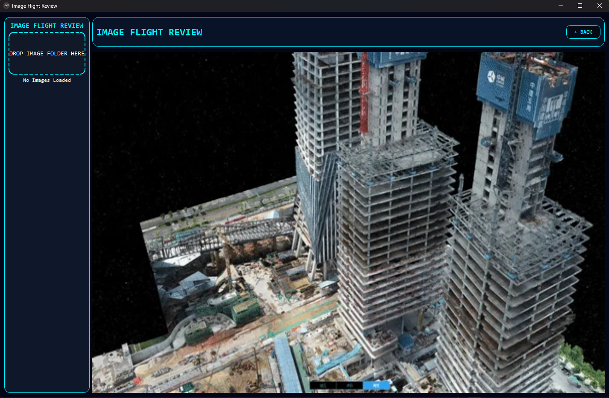

# BETA_LOG UAV Ground Control Station (GCS)

## Overview

BETA_LOG UAV Ground Control Station (GCS) is a desktop-based UAV analysis and geotagging platform developed for PX4-powered unmanned aerial vehicles. The system provides mission analysis, image geotagging, flight visualization, and image flight review tools in a unified interface.

The application is designed to assist drone operators, survey teams, mapping professionals, researchers, and UAV developers in processing flight logs and aerial imagery captured during autonomous missions.

---

## Features

# BETALOG UAV Ground Control Station

## Loading Screen



---

## Launcher



---


## PX4 GeoTagger



---

## Image Flight Review



### PX4 GeoTagger Module

* PX4 ULog file support
* Automatic mission start detection
* GPS extraction from flight telemetry
* Flight path visualization
* Image geotagging using PX4 flight logs
* Time-Based synchronization mode
* EXIF-Based synchronization mode
* GPS metadata injection into images
* Progress monitoring and processing logs
* Export of geotagged images

### Image Flight Review Module

* Drag-and-drop image folder loading
* Automatic GPS metadata extraction
* Flight path reconstruction from image geotags
* Interactive map visualization
* Start and End waypoint identification
* GPS validation of captured imagery
* Geotag verification workflow

### Flight Visualization

* Interactive map display
* Mission trajectory plotting
* GPS marker visualization
* Start and End mission indicators
* Flight route review

### User Interface

* Modern UAV-inspired interface
* Drag-and-drop workflow
* Multi-module launcher system
* Integrated telemetry review
* Dark-themed operational dashboard

---


### Flight Logs

* PX4 ULog (*.ulg)

### Images

* JPG
* JPEG
* PNG

### Metadata

* GPS Coordinates
* Altitude
* EXIF DateTimeOriginal
* Camera Information

---

## Technology Stack

### Programming Language

* Python 3.11+

### GUI Framework

* PySide6 (Qt6)

### Mapping

* Folium
* OpenStreetMap

### Flight Log Processing

* PyULog

### Image Processing

* Pillow
* piexif

### Packaging

* PyInstaller

---

## Project Structure

```text
UAV_GCS/
│
├── app/
│   ├── main.py
│   └── launcher_window.py
│
├── modules/
│   │
│   ├── px4_geotagger/
│   │   ├── backend/
│   │   ├── ui/
│   │   └── assets/
│   │
│   ├── Image_flight_review/
│   │   ├── backend/
│   │   ├── ui/
│   │   └── assets/
│   │
│   └── ma_engine/
│
├── assets/
│   ├── icons/
│   ├── images/
│   └── gifs/
│
└── core/
    └── utils/
```

---

## Installation

### Clone Repository

```bash
git clone <repository-url>
cd UAV_GCS
```

### Create Environment

```bash
conda create -n UAV_GCS python=3.11
conda activate UAV_GCS
```

### Install Dependencies

```bash
pip install -r requirements.txt
```

---

## Running the Application

```bash
python -m app.main
```

---

## Building Executable

### Development Build

```bash
python -m PyInstaller --clean --onedir --windowed --icon=assets/icons/uav_gcs.ico --add-data "assets;assets" --add-data "modules/px4_geotagger/assets;modules/px4_geotagger/assets" --add-data "modules/Image_flight_review/assets;modules/Image_flight_review/assets" --name BETALOG_Test app/main.py
```

### Portable Build

```bash
python -m PyInstaller --clean --onefile --windowed --icon=assets/icons/uav_gcs.ico --add-data "assets;assets" --add-data "modules/px4_geotagger/assets;modules/px4_geotagger/assets" --add-data "modules/Image_flight_review/assets;modules/Image_flight_review/assets" --name BETALOG_Portable app/main.py
```

---

## Workflow

### PX4 GeoTagging

1. Launch BETALOG GCS
2. Open PX4 GeoTagger
3. Load PX4 ULog file
4. Load image folder
5. Select synchronization mode
6. Configure synchronization parameters
7. Select output folder
8. Start geotagging process
9. Review generated results

### Image Flight Review

1. Launch BETALOG GCS
2. Open Image Flight Review
3. Drag image folder into application
4. Automatically extract GPS metadata
5. Visualize image flight path
6. Verify geotag accuracy

---

## Current Status

### Implemented

* PX4 ULog parsing
* Mission detection
* GPS extraction
* Interactive mapping
* Image geotagging
* EXIF processing
* Image Flight Review module
* Multi-module launcher

### Planned Features

* Distance-Based synchronization
* Advanced flight analytics
* Mission quality assessment
* Flight anomaly detection
* AI-assisted mission review
* Enhanced 3D visualization
* Telemetry dashboard integration

---


## License

This project is licensed under the MIT License.

See the  [LICENSE](UAV_GCS/LICENSE) file for details.

---

## Author

John Dasig

Computer Engineering

Technological Institute of the Philippines (T.I.P.)

BETALOG UAV Ground Control Station Project


